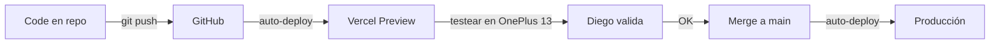

<p align="center">
  <picture>
    <source media="(prefers-color-scheme: dark)" srcset="data:image/svg+xml,%3Csvg xmlns='http://www.w3.org/2000/svg' viewBox='0 0 400 60'%3E%3Ctext x='200' y='42' text-anchor='middle' font-family='Arial Black,Arial,sans-serif' font-size='34' font-weight='900' fill='%23FAFAF7'%3Esit%3Ctspan fill='%23FFD60A'%3E●%3C/tspan%3Eazo%3Ctspan fill='%23FFD60A'%3E.cl%3C/tspan%3E%3C/text%3E%3C/svg%3E">
    
  </picture>
</p>

<p align="center">
  <strong>Próximos Pasos — v1.0 → Producción</strong><br>
  <sub><em>Lo que Diego necesita completar antes del launch</em></sub>
</p>

---

## 🔴 BLOQUEANTES PARA PRODUCCIÓN

<sub><em>Estas 3 acciones DEBEN completarse antes de apuntar el dominio a Vercel.</em></sub>

### 1. WhatsApp Business

```
[x] Código listo — todos los CTA usan NEXT_PUBLIC_WHATSAPP_NUMBER
[ ] Descargar WhatsApp Business (Android/iOS)
[ ] Configurar perfil:
    - Nombre empresa: Sitiazo.cl
    - Categoría: Servicios profesionales > Diseño web
    - Descripción: "Páginas web que sí venden. Para pymes chilenas.
      Listo en 7 días, desde $199K."
    - Email: hola@sitiazo.cl
    - Web: sitiazo.cl
    - Dirección: Curicó, Maule
[ ] Mensaje de bienvenida automático:
    "Hola! Soy Diego de Sitiazo.cl 🟡 Gracias por escribirnos.
    Cuéntanos sobre tu pyme y te ayudamos a tener tu sitiazo.
    Respondemos en horas laborales (L-V 9-19hrs)."
[ ] Horario: L-V 9:00-19:00
[ ] Editar .env.local con el número real:
    NEXT_PUBLIC_WHATSAPP_NUMBER=569XXXXXXXX
[ ] Hacer deploy en Vercel con la nueva variable
```

**⏱️ Tiempo estimado**: 30 minutos

---

### 2. Email (Cloudflare Email Routing)

```
[ ] Ir a Cloudflare Dashboard → tu dominio → Email → Email Routing
[ ] Crear ruta: hola@sitiazo.cl → reenviar a tu Gmail personal
[ ] Verificar que al mandar mail a hola@sitiazo.cl llegue a tu inbox
[ ] (Opcional) Configurar SMTP para responder desde hola@sitiazo.cl
```

**⏱️ Tiempo estimado**: 15 minutos

---

### 3. Cal.com

```
[ ] Ir a cal.com → crear cuenta gratis
[ ] Crear event type: "Consulta Sitiazo — 30 min"
    - Duración: 30 minutos
    - Ubicación: Google Meet
    - Descripción: "Conversamos sobre tu proyecto web.
      Sin costo, sin compromiso."
[ ] Configurar disponibilidad (ej: L-V 14:00-18:00)
[ ] Copiar el link público (ej: cal.com/diego/consulta-sitiazo)
[ ] Editar .env.local:
    NEXT_PUBLIC_CALCOM_URL=https://cal.com/diego/consulta-sitiazo
```

**⏱️ Tiempo estimado**: 15 minutos

---

## 🟡 ACCIONES IMPORTANTES

<sub><em>No bloquean el launch, pero mejoran calidad y conversión. Hacer en la primera semana post-launch.</em></sub>

### 4. Screenshots Reales de Roma Crochet

```
[ ] Abrir Chrome → romacrochet.cl
[ ] DevTools (F12) → Toggle device toolbar (Ctrl+Shift+M)
[ ] Seleccionar iPhone 14 Pro (393×852)
[ ] Refresh → Captura full size (3 dots menu → "Capture full size screenshot")
[ ] Guardar como: public/images/cases/romacrochet-mobile-real.png
[ ] Repetir con desktop (1440×900):
    public/images/cases/romacrochet-desktop-real.png
[ ] Reemplazar los <StillLifePlaceholder /> de / y /casos/roma-crochet
    con <StillLifeImage src="/images/cases/romacrochet-mobile-real.png" ... />
```

**⏱️ Tiempo estimado**: 20 minutos

---

### 5. OG Images (Social Share)

```
[ ] Abrir Figma (o pedir a GPT-4o) con estas specs:
    - Tamaño: 1200×630px
    - Fondo: cream (#FAFAF7) o ink (#0A0A0A) según variante
    - Logo sitiazo.cl centrado (Archivo Black)
    - Yellow dot decorativo
    - Sin texto descriptivo largo, el logo + dominio es suficiente

[ ] Generar 3 variantes:
    - public/images/logo/og-image.png       → Home
    - public/images/logo/og-image-cases.png  → Casos
    - public/images/logo/og-image-planes.png → Planes

[ ] Actualizar metadata en layout.tsx para usar estas imágenes
```

**⏱️ Tiempo estimado**: 30 minutos (o 1 prompt a GPT-4o)

---

### 6. Apple Touch Icon

```
[ ] Usar el favicon.svg existente como base
[ ] Exportar PNG 180×180 con fondo amarillo + "s" negra + dot negro
[ ] Guardar como: public/apple-touch-icon.png
[ ] (Ya incluido en el <head> vía next.js metadata)
```

**⏱️ Tiempo estimado**: 5 minutos

---

## ⚪ MEJORAS POST-LAUNCH (v1.5)

<sub><em>Para cuando hayas validado con clientes reales. 1-2 semanas después del launch.</em></sub>

### 7. Still-Life Imágenes Reales

```
[ ] Generar 15-20 composiciones editoriales en GPT-4o:
    - Cubos negros mate + esferas cerámica + papel roto + phone mockups
    - Con el prompt del design system (sección 6)
[ ] Reemplazar <StillLifePlaceholder /> en todas las páginas
    con <StillLifeImage src="..." /> usando las imágenes generadas
[ ] Prioridad: Hero (/) → Caso Roma Crochet → Planes → Como Funciona
```

**⏱️ Tiempo estimado**: 1 tarde de sesión con GPT-4o

---

### 8. Dominio sitiazo.cl → Vercel

```
[ ] Comprar dominio sitiazo.cl (si no lo tenés)
[ ] En Vercel → Settings → Domains → Add sitiazo.cl
[ ] En tu proveedor DNS → agregar registros que Vercel te indica
[ ] Esperar propagación DNS (5 min - 48 hrs)
[ ] Verificar con: curl -I https://sitiazo.cl
[ ] Configurar redirect de www → non-www (o viceversa)
[ ] Actualizar NEXT_PUBLIC_SITE_URL en .env.local a https://sitiazo.cl
[ ] Re-deploy
```

**⏱️ Tiempo estimado**: 30 minutos (más propagación DNS)

---

## 📊 Pipeline de Contenido

### 9. Blog — Escribir Posts

```
[ ] Post 1: "Cuánto cuesta una página web en Chile (precios reales 2026)."
    - Slug: precios-paginas-web-pymes-chile-2026
    - Estructura YA CREADA en app/blog/[slug]/page.tsx
    - Revisar y ajustar contenido según tu experiencia real

[ ] Post 2: "Caso real: cómo Roma Crochet pasó de DM a web propia."
    - Slug: caso-roma-crochet-amigurumis-curico
    - Estructura YA CREADA
    - Agregar screenshots, métricas reales, testimonio de Roma

[ ] Post 3: "WhatsApp Business + página web: cómo combinarlos para vender más."
    - Slug: whatsapp-business-pagina-web-pymes
    - Estructura YA CREADA
    - Agregar estadísticas chilenas, ejemplos concretos
```

---

## 🔄 Flujo de Desarrollo Continuo



---

## 🟡 Checklist Final — ¿Listo para Launch?

- [ ] WhatsApp Business configurado + número en `.env.local`
- [ ] Email `hola@sitiazo.cl` funcional
- [ ] Cal.com con slot de 30 min + link en `.env.local`
- [ ] Dominio apuntado a Vercel
- [ ] SSL activo (Vercel lo hace automático)
- [ ] Favicon visible en pestaña del navegador
- [ ] `npm run build` pasa SIN errores
- [ ] Mobile test en OnePlus 13 (375px, 393px)
- [ ] Desktop test en Chrome 1280px+
- [ ] WhatsApp links abren chat con mensaje pre-armado
- [ ] Email links abren cliente de correo con subject
- [ ] Cal.com link abre página de agendamiento
- [ ] Sitemap.xml accesible en `sitiazo.cl/sitemap.xml`
- [ ] Robots.txt accesible en `sitiazo.cl/robots.txt`
- [ ] Google Search Console conectado
- [ ] Google Analytics 4 conectado

---

<p align="center">
  <br>
  <svg width="16" height="16" viewBox="0 0 16 16"><circle cx="8" cy="8" r="8" fill="%23FFD60A"/></svg>
  <sub> v1.0 · Sitiazo.cl · Curicó, Maule · Chile · 2026</sub>
  <svg width="16" height="16" viewBox="0 0 16 16"><circle cx="8" cy="8" r="8" fill="%23FFD60A"/></svg>
</p>
